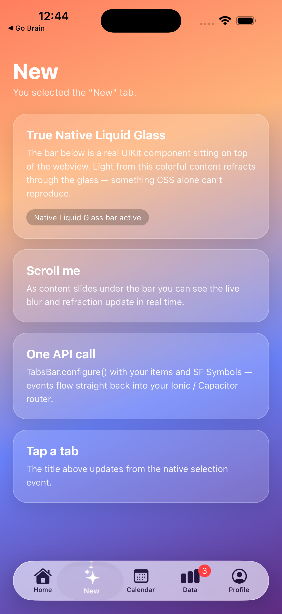

# Stay Liquid: Native Liquid Glass for Ionic & Capacitor Applications

The introduction of Apple’s new Liquid Glass design language poses a challenge for Ionic and Capacitor developers. The native Liquid Glass components use techniques beyond the capabilities of CSS to render the effects of light from the layers behind as they pass through the element.

Stay Liquid works as a way of rendering true Native Liquid Glass components on top of Ionic’s webview. Simply call the plugin from within your Typescript or Javascript code. When an event is registered on the native component, it emits an event which is apssed back to Ionic for you to handle.

The first component available is the Tab Navigation bar, but over time we will extend this further to other components. Installation and usage instructions can be found below.

***In the meantime, Stay liquid.***


### 📸 Live screenshot

Below is the bundled [`example`](example/) app running on an iPhone 17 Pro Max (iOS 26). The bar at the bottom is a real native `UITabBar` rendering Liquid Glass on top of the Capacitor webview — notice the colourful content refracting through the glass as it scrolls underneath.

<p align="center">
  
</p>

## 📦 Installation

We’re not on npm (yet) but you can still install from GitHub using npm.

```powershell
npm i https://github.com/alistairheath/stay-liquid
```

Then sync it to your Ionic or Capacitor build.

```powershell
ionic cap sync ios
```

## 🚀 Usage

In `tabs.page.ts` import the TabsBar from the stay-liquid library. You’ll also want to import some helper functions from rxjs and the router for your framework. Here we’re using Angular but similar principles could be applied to react and Vue.

```tsx
//IMPORTS
import { Device, DeviceInfo } from '@capacitor/device';
import { TabsBar } from 'stay-liquid';
import { filter, Subscription } from 'rxjs';
import { Router, NavigationEnd } from '@angular/router';
```

Then in you class add an `ionViewDidEnter()`  method that initiates the Liquid Glass TabBar if the app is running on iOS and iOS version 26+.

```tsx
  private sub?: Subscription;
  private useNativeTabs: boolean = false;
  async ionViewDidEnter() {
    const deviceInfo: DeviceInfo = await Device.getInfo();
    if (deviceInfo.platform !== 'ios') return; // keep Ionic tabs on web/android
    if (deviceInfo.iOSVersion && deviceInfo.iOSVersion >= 260000) {
      this.useNativeTabs = true;
    } else {
      return;
    }

    await TabsBar.configure({
      visible: true,
      initialId: 'home',
      items: [
        { id: 'home', title: 'Home', systemIcon: 'house' },
        { id: 'new', title: 'New', systemIcon: 'sparkles' },
        { id: 'calendar', title: 'Calendar', systemIcon: 'calendar' },
        { id: 'data', title: 'Data', systemIcon: 'chart.bar' },
        { id: 'settings', title: 'Settings', systemIcon: 'gear' },
      ],
      // Optional: Customize tab icon colors
      selectedIconColor: '#007AFF',      // Blue for selected tab
      unselectedIconColor: '#8E8E93'     // Gray for unselected tabs
    });

    // Native → JS (user taps native tab)
    await TabsBar.addListener('selected', ({ id }: { id: string }) => {
      this.router.navigateByUrl(`/tabs/${id}`);
    });

    // JS → Native (keep native highlight in sync with route)
    this.sub = this.router.events
      .pipe(filter(e => e instanceof NavigationEnd))
      .subscribe(() => {
        const id = this.routeToTabId(this.router.url);
        if (id) TabsBar.select({ id });
      });
  }

  private routeToTabId(url: string): string | null {
    if (url.startsWith('/tabs/home')) return 'home';
    if (url.startsWith('/tabs/new')) return 'new';
    if (url.startsWith('/tabs/calendar')) return 'calendar';
    if (url.startsWith('/tabs/data')) return 'data';
    if (url.startsWith('/tabs/settings')) return 'settings';
    return null;
  }
```

⚠️ Remember: You will need to build and run with iOS 26+ from Xcode Beta for the navigation bar to be visible.

👀 If you are using Ionic’s tabs for other platforms, you can use the above useNativeTabs attribute to hide them on iOS 26+.

```html
<ion-tabs [class.hidden]="useNativeTabs">
    ... Tabs content here
</ion-tabs>
```

## 🎨 Color Customization

Stay Liquid now supports dynamic color customization for tab icons. You can specify custom colors for both selected and unselected tab states using hex or RGBA color formats.

### Supported Color Formats

- **Hex Colors**: `#FF5733`, `#F57` (3-digit), `#FF5733FF` (with alpha)
- **RGBA Colors**: `rgba(255, 87, 51, 1.0)`, `rgb(255, 87, 51)`

### Configuration Options

```tsx
await TabsBar.configure({
  items: [...],
  // Color customization options
  selectedIconColor: '#FF5733',           // Hex color for selected tab
  unselectedIconColor: 'rgba(142, 142, 147, 0.6)', // RGBA color for unselected tabs
});
```

### Color Examples

```tsx
// Example 1: Using hex colors
await TabsBar.configure({
  items: [...],
  selectedIconColor: '#007AFF',      // iOS blue
  unselectedIconColor: '#8E8E93'     // iOS gray
});

// Example 2: Using RGBA colors with transparency
await TabsBar.configure({
  items: [...],
  selectedIconColor: 'rgba(0, 122, 255, 1.0)',    // Blue with full opacity
  unselectedIconColor: 'rgba(142, 142, 147, 0.6)' // Gray with 60% opacity
});

// Example 3: Using short hex notation
await TabsBar.configure({
  items: [...],
  selectedIconColor: '#F57',    // Expands to #FF5577
  unselectedIconColor: '#999'   // Expands to #999999
});

// Example 4: Dynamic color changes
setTimeout(async () => {
  await TabsBar.configure({
    items: [...],
    selectedIconColor: '#FF3B30',  // Change to red
    unselectedIconColor: '#C7C7CC' // Change to lighter gray
  });
}, 3000);
```

### Color Validation & Fallbacks

- Invalid color formats will trigger warnings and fall back to system defaults
- Colors are validated on both TypeScript and iOS sides
- Color changes apply immediately and persist across tab selections
- If no colors are specified, the system uses iOS default colors

## 🖼️ Image Icon Support

Stay Liquid now supports comprehensive image icons with advanced features including remote URL loading, base64 data URIs, caching, and fallback handling. The new `imageIcon` property provides enhanced control over icon appearance and behavior.

### ImageIcon Structure

```tsx
interface ImageIcon {
  shape: 'circle' | 'square';           // Icon container shape
  size: 'cover' | 'stretch' | 'fit';    // Image scaling behavior
  image: string;                        // Base64 data URI or HTTPS URL
}
```

### Shape Options

- **`circle`**: Circular icon container with rounded edges
- **`square`**: Square icon container (default)

### Size Options

- **`cover`**: Aspect fill - crops image to fill container while maintaining aspect ratio
- **`stretch`**: Stretches image to fill container exactly (may distort aspect ratio)
- **`fit`**: Aspect fit - scales image to fit within container while maintaining aspect ratio

### Image Sources

#### Base64 Data URIs
```tsx
await TabsBar.configure({
  items: [
    {
      id: 'home',
      title: 'Home',
      systemIcon: 'house', // Fallback if imageIcon fails
      imageIcon: {
        shape: 'circle',
        size: 'cover',
        image: 'data:image/png;base64,iVBORw0KGgoAAAANSUhEUgAAAAEAAAABCAYAAAAfFcSJAAAADUlEQVR42mP8/5+hHgAHggJ/PchI7wAAAABJRU5ErkJggg=='
      }
    }
  ]
});
```

#### Remote URLs
```tsx
await TabsBar.configure({
  items: [
    {
      id: 'profile',
      title: 'Profile',
      systemIcon: 'person', // Fallback for network errors
      imageIcon: {
        shape: 'circle',
        size: 'fit',
        image: 'https://example.com/avatar.png'
      }
    }
  ]
});
```

### Supported Image Formats

- **PNG**: `image/png`
- **JPEG**: `image/jpeg`, `image/jpg`
- **SVG**: `image/svg+xml`
- **WebP**: `image/webp`

### Security Features

- **HTTPS Only**: Remote URLs must use HTTPS protocol for security
- **CORS Handling**: Automatic handling of cross-origin requests
- **Content-Type Validation**: Server responses are validated for supported image formats
- **File Size Limits**: Maximum 5MB file size to prevent memory issues
- **Format Validation**: Only supported image formats are processed

### Performance Features

#### Image Caching
- Remote images are automatically cached for 24 hours
- Cache prevents redundant network requests for the same URL
- Automatic cache cleanup removes expired entries

#### Loading States
- Smooth transitions between loading, loaded, and error states
- Automatic fallback to `systemIcon` during loading or on error
- Non-blocking asynchronous image loading

#### High-DPI Support
- Automatic scaling for retina and high-DPI displays
- Optimized rendering for different screen densities

### Error Handling & Fallbacks

The imageIcon system provides robust error handling with automatic fallbacks:

1. **Primary**: `imageIcon` (if specified and loads successfully)
2. **Secondary**: `systemIcon` (SF Symbol fallback)
3. **Tertiary**: `image` (bundled asset fallback)
4. **Final**: Empty placeholder

```tsx
await TabsBar.configure({
  items: [
    {
      id: 'example',
      title: 'Example',
      systemIcon: 'star',        // Fallback if imageIcon fails
      image: 'bundled-asset',    // Further fallback if systemIcon unavailable
      imageIcon: {
        shape: 'circle',
        size: 'cover',
        image: 'https://example.com/icon.png' // Primary choice
      }
    }
  ]
});
```

### Complete Examples

#### Mixed Icon Types
```tsx
await TabsBar.configure({
  items: [
    {
      id: 'home',
      title: 'Home',
      systemIcon: 'house',
      imageIcon: {
        shape: 'circle',
        size: 'cover',
        image: 'https://example.com/home-icon.png'
      }
    },
    {
      id: 'search',
      title: 'Search',
      systemIcon: 'magnifyingglass' // Uses SF Symbol
    },
    {
      id: 'profile',
      title: 'Profile',
      image: 'profile-asset', // Uses bundled asset
      systemIcon: 'person'    // Fallback
    }
  ],
  selectedIconColor: '#007AFF',
  unselectedIconColor: '#8E8E93'
});
```

#### Different Shapes and Sizes
```tsx
await TabsBar.configure({
  items: [
    {
      id: 'avatar',
      title: 'Avatar',
      systemIcon: 'person.circle',
      imageIcon: {
        shape: 'circle',    // Circular avatar
        size: 'cover',      // Crop to fill
        image: 'https://example.com/avatar.jpg'
      }
    },
    {
      id: 'logo',
      title: 'Logo',
      systemIcon: 'app',
      imageIcon: {
        shape: 'square',    // Square container
        size: 'fit',        // Fit within bounds
        image: 'data:image/png;base64,iVBORw0...'
      }
    },
    {
      id: 'banner',
      title: 'Banner',
      systemIcon: 'rectangle',
      imageIcon: {
        shape: 'square',    // Square container
        size: 'stretch',    // Fill exactly (may distort)
        image: 'https://example.com/banner.png'
      }
    }
  ]
});
```

### Best Practices

1. **Always provide fallbacks**: Include `systemIcon` for reliable fallback behavior
2. **Optimize image sizes**: Use appropriately sized images (30x30px recommended for tab icons)
3. **Use HTTPS**: Only HTTPS URLs are supported for security
4. **Consider loading states**: Images load asynchronously, so fallbacks are shown initially
5. **Test error scenarios**: Verify behavior with invalid URLs or network failures
6. **Cache considerations**: Remote images are cached, so updates may require cache clearing

## 🧪 Running the example app

A minimal Capacitor demo lives in [`example/`](example/). It loads a colourful scrolling page and calls `TabsBar.configure(...)` to render the native Liquid Glass bar — this is exactly what produced the screenshot above.

```bash
# From the repo root: build the plugin first
npm install && npm run build

# Then build and run the demo
cd example
npm install
npx cap sync ios

# Open in Xcode and run on an iOS 26 simulator/device...
npx cap open ios
```

Or build straight from the command line onto a booted iOS 26 simulator:

```bash
cd example/ios/App
xcodebuild -workspace App.xcworkspace -scheme App \
  -sdk iphonesimulator -destination 'generic/platform=iOS Simulator' \
  -derivedDataPath build CODE_SIGNING_ALLOWED=NO build
xcrun simctl install booted build/Build/Products/Debug-iphonesimulator/App.app
xcrun simctl launch booted vn.fighttech.stayliquid.example
```

> The native Liquid Glass styling only appears on **iOS 26+**. On the web or older iOS the app falls back to your normal Ionic/Capacitor tabs.

## 🔜 Contributing and Further Developments

Stay liquid is still a proof-of-concept but the idea of rendering specific native components on top of Ionic's webview is an idea worth exploring. So far, we have implemented this solely for the tabs navigation bar but I hope to build out the library to contain more components and add more flexibility into how each component can be controlled from within Ionic.

The recent addition of comprehensive image icon support demonstrates the potential for rich, native-quality user interfaces while maintaining the flexibility of web technologies.

If you want to help, please feel free to report bugs, ask questions and create new branches.
